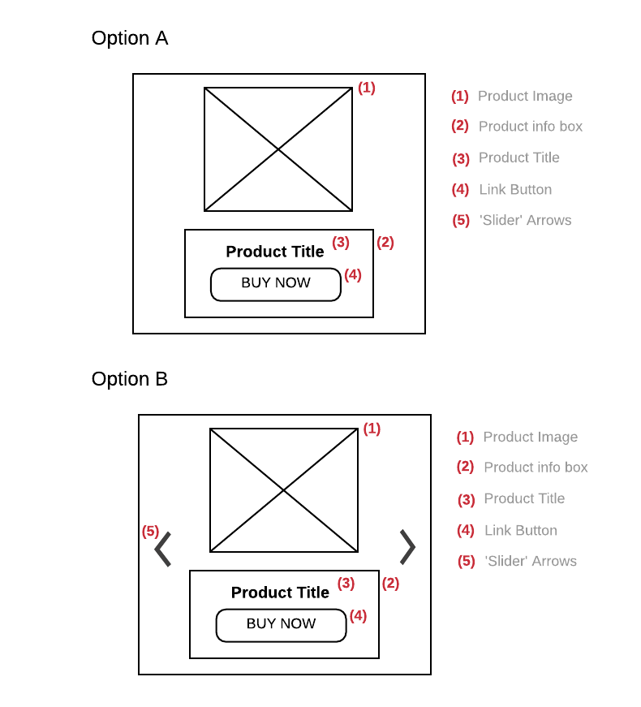

# Affectv Front-End Exercise

## What to do?

We want to build a "Ad HTML Generator". This AngularJS app will consist of a single screen containing a set of configurable values related to CSS styles.

After choosing the desired values and pressing the Submit button, this app should dynamically build and display the HTML code for a fixed size [Web Banner](https://en.wikipedia.org/wiki/Web_banner) (Ad), using the specified color values, together with some product information obtained from an JSON feed.

## The Ad HTML Generator App

> Please note this AngularJS app can be enhanced using any additional framework/library you can consider particularly useful.

User will put the values on the Input boxes, specifying some colors for the Ad (e.g. `#0066cc`, or `blue`)

After pressing the "Get Product Feed and Generate Ad" button:

1. The app will obtain a Product Feed data from `/api/products.json`

2. The app will generate the HTML code for the Ad using:
    * The product information obtained in the previous step.
    * The CSS properties from the form.

3. The app will display the generated HTML code on the right-side **HTML** section (as text).

4. The app will display the Ad on the right-side **Preview** section. (e.g. using an directive/iframe)

#### The left-hand controls (properties):

* Styles for the "Product Info Box":
    * Two `input` boxes, for CSS `background-color` and `color` properties.
    * This will control the colors for the "Product Info Box" section of the Ad. User will put there CSS color property values. (e.g. `#0066cc`)

* Styles for the "Link Button":
    * Two `input` boxes, for CSS `background-color` and `color` properties.
    * This will control the colors for the "Link Button" section of the Ad. User will put there CSS color property values. (e.g. `#0066cc`)

* "Get Product Feed and Generate Ad"
    * A `submit` button
    * It will execute the process.

## The Generated Ad

The 'output' for the Ad should consist in a **full HTML page containing inline JS/CSS** code. This  Ad HTML should **not** request any external libraries, files or make any AJAX calls.

The design we propose for the Ad would be a basic layout consisting in a white background, a centred image on top, and a centred box on the bottom, including the name of the product and a 'Buy Now' link.

About the behaviour of the Ad, we propose you different alternatives. Please **implement at least one** of the two options below (or feel free to create a new one!)

The **first** option will be to build a basic version of an ad. This ad must show just the **first** product obtained from the JSON response.

The **second** option shares the same layout, but now including a basic **slider** for navigating thorough all the products. This will be controlled with two arrow buttons (left and right).

* **Product Image:** Product image from `JSON > data > products > img`.
* **Product Info Box:** Area that will contain the product information. Background and text colors configurable by the app.
* **Product Title:** Name of the product. (`JSON > data > products > name`).
* **Link Button:** Link with a button look-and-feel that will point to (`JSON > data > products > link`). Background and text colors configurable by the app.

The proposed size for the Ad is 300x250.

### The HTML code for the Generated Ad

As mentioned before, the Ad should consist in a full HTML unit (containing all basic html, body, header, script... tags). All JavaScript and CSS code must be embeded inside this HTML.

   Example of the resulting HTML:

        <!DOCTYPE html>
        <html>
          <head lang="en">
            <meta charset="UTF-8">
            <title></title>
            
          </head>
          <body>
          ...
          
          </body>
        </html>

# This base project

This base project consists in a basic set of files for an AngularJS application, that can be served using the `gulp` default task which will run a basic webserver under `http://localhost:8080`.

Please remember to execute the `npm install` command first, in order to install any required dependencies.

The entry point of this app would be the `index.html` file on the root folder.

## Directory layout

    /api/        --> Simulates the API server from we were going to obtain all product data.
    /css/
    /img/
    /js/
    gulpfile.js
    package.json
    index.html

Please feel free to modify **any** of the files of this exercise.

# Technical requirements and notes

* The app should work in a modern Chrome browser.
* Please feel free to include/change/reuse/invent any other framework/library/piece-of-code you think will be useful for those purposes.
* BONUS (in no special order): Testing, NodeJS version of the API, Improved Ad design, Improved App UI design, More CSS controls, Improved build tasks, JS/CSS preprocessing, CSS animations, Multiple Ad-Designs....

